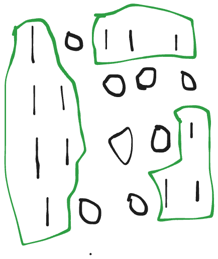

to me for medium

### Group Anagram

- Initialize a map where the key is an array of 26 integers (one for each letter) and the value is a slice of strings (the group of anagrams)
- range through the strings
- Initialize an array of 26 integers to count the frequency of each character in the string. so therefore k = [0,0,0,0,0,0,0...........0] for intialization.
- range through each character in the string
- Update the frequency count for the character in the array, so for example if char = e then k[e-a] a = 0 and e = 4 our int calculation, so k[4] will be incremented from 0 to 1, therefore k = [0,0,0,0,1,0,0........0] and we check for each character in the string like that till we are done with the string
- Use the character frequency array as a key in the map and append the string to the corresponding group. after done with each string, we make k the key of our map and the string the value as intitalized. like this hmap[[26]int{1, 0, 0, ..., 1, ..., 1, 0, 0}] = ["eat"]. we do that for all the word in the array string
- we have intialized a slice that holds our result
- Iterate over the map and append each group of anagrams to the result slice and remember each key in a hashmap must be unique, if you try to insert a key that already exists in the map, the new value will overwrite the existing value for that key. so we assign each value to a slice.

### Top K Frequent

- so here we are checking an array and checking the most Frequent k element
- we can use 2 approach but first we are going to be creating a map that will store the occurence of each num
- the first method and second method uses this process, by creating a double slice that have the size of len(nums)+1, then we go on by storing the occurence as the inner loop with the nos as the array slice position, for example: [1,1,1,2,4,4] is our array then our map will be [1:3, 2:1, 4:2] then our double slice will be [[], [2], [4], [1], [], [], [], []] which means that double_slice[3] will take our input 1 and double_slice[1] will take our input 2.
- when done, the first method after our double slice will range through our double_slice from the back, if double_slice[i] is not equal to nil, we append all the data in our double_slice to the result array and then check if len of result is equal to or greater than k, if it is the later we take only the first k element of the array
- the second method, is to range through the double_slice from the back, then we range through the double_slice[i] element, check if k > 0 and if not we append value from the double_slice[i] element to the array result and decrement out k value

### product Except Self

- we are returning an array, which is the product of our input array without the array position in relation to the result array, so there are some barriers in this array because we are not suppose to use division at all in our solution.
- so we are going to be using a prefix and suffix solution here, prefix will find the products from the front and suffix with do the product from the back
- prefix solution will go like this, when we range through the nums array, we will make sure to equalize our result position(res[i]) to the prefix and the prefix will always be Updated with new figures because we are multiplying it by the nums position(nums[i])
- suffix will eqaully go like this from the end, but here instead our result position is being updated with the product of our suffix, and the suffix is being updated with the nums position
- every variables get updated upon each iteration, and also i noticed that you dont need to get to the last and first array when performing both prefix and suffix operation

### longest Consecutive

- we can use slices.Sort to sort this and check the longest Consecutive there but the question want us to solve this in o(n) instead of introducing the sorting algorithm that uses o(logn)
- so for our o(n) operation, we are going through the nums and making sure that a number does not occur more than one, so we are using the normal map for this
- so right now the problem we have is that our map is not ordered, we range through the nums again and we check if n-1 is not in the map, if it is not we assign our currentLength to 1 and assign an var current to n
- so now we are working with current and currentLength, we go on further to check if current(our n) + 1 is in the map(if it is not we go to the next num but if it is we increment the current by 1) and also currentLength by 1
- when we are done with all the number, remember that upon each number that does not have it Consecutive nos in the array, we are going to be reasssigning our currentLength to 1, upon getting the longest Consecutive we are going to be comparing it to the maxLength and equating it to the maxLength (if the maxLength is less than currentLength)
- finally we return maxLength

### Two Sum II

- so this is a medium and also a follow up question to the easy question (2 sum) and here our array is sorted
- binary search will be used here to solve the problem and for l < r{}
- the algorithm is that on addition of nums in l and r, we check if it is greater than or less than our target
- so if nums[l] + nums[r] is greater than target, r is decremented and if nums[l]+ nums[r] is less than target, l is incremented and if we get our answer, we store it in an array and return it

### ThreeSum

- three sums with our idea from two sums II, we are going to be sorting the algorithm (using the slices.Sort)
- range through the nums with index(i) and each num(n), checking if i is greater than 0 and n is not equal to the nos before nos(i-1)
- upon introducing binary search, we then intitalize our threeSum which is the addition of n + nums[l] + nums[r] and if threeSum is greater than 0(our target) we decrement r, and if it is lessthan 0 we increment l
- else we append our result to the double slice created, and remember we need multiple instances where our threeSum is equal to target and not only one possible scenario
- When we are done with the first result already appended, we go back to the array by incrementing l and checking if nums[l] is equal to nums[l-1] and l < r for more results

### MaxArea

- Binary search is going to be used here
- while l is less than r, we are going to intitalize our area as l-r \* min(nums[l], nums[r])
- we keep on updating the max value with the our intitalized res, and checking if nums[l] is less than nums[r], we increment l and we decrement r if not

### Length Of Longest Substring

- so here we are using the sliding window techniques(double pointer as in the case of binary search)
- so both left and right start at the beginning but the right is being incremented till the end of the string and they are stored in a map
- When a letter appear more than once, we decrease the value from the map and increment the left
- our result is being stored as the max value in comparison with (right-left+1) which is our current position in the string

### Longest repeating character Replacement

- we are finding the length of the longest substring that can be obtained by replacing at most k characters in the input string s with any other character
- this approach uses a sliding window techniques, which is our left and right
- maxF tracks the maximum freq of any single characters
- we traverse over the string and store our letter in the map with their occurence
- we are checking and storing for the max between each letter r in our map

### Find Min in a rotated sorted array

- so here we are using Binary search, and upon intialization we check if l is less than right
- we define our middle immediately after the (for) loop
- we check for difference, if left is greater than right, left is updated to middle + 1
- else that means if left is less than right, we equate right to middle
- upon all our min num will end at l, then we return it

### searching a particular number in a rotated sorted array

- we have our rotated array here and we are going through it by searching a certain target in it
- we are using binary search also here because we are to submit it in Ologn
- we define our left and right, initiate our loop and define our middle
- so basically it is all suppose to come down to the middle, and remember we check for middle as result at the beginning of our loop, so here our approach is that we want to divide the array into left and right and how do we check intiallialy if we are meant to use the left or the right
- if l is lessthan or equal to middle that means we should check the left because it is sorted but if it is the other way round, we are checking the right because that means our right is being sorted
- for the left part, we are checking with our target next, if our target is greater than left and our target is less than middle, we update our right as middle + 1 else our left is updated as middle - 1
- for the right part, we are checking with our target, if target is greater than middle and target is less than right, we update our left as middle + 1 else the right as middle - 1
- at the end if the target is not in the array, we return -1

### Re-Order List

- we are going to be re-ordering a list in this format.
  

- so in this question we are not returning anything but only our input back
- we check for all base cases and return nothing also
- we are using a fast and slow pointer(floyd tortoise and hare method), the slow pointer move at `1*` speed and the fast pointer move at `2*` speed
- so here we are trying to get the middle of our listNode and it our slow that will help use to get there and remember the fast is moving at `2*` pace so we should remember to make sure our fast get to null because of odd lens
- we swap values upon getting the second half of the listNode
- we then go on to merge the two halves of the listNode
- The two halves of the list are merged. first traverses the first half, and prev (now the head of the reversed second half) traverses the reversed second half
- For each node in the first half, the next node is set to the corresponding node from the reversed second half, effectively weaving the two halves together.

##### to Illustrate

consider the list: `1 -> 2 -> 3 -> 4 -> 5`
Finding the Middle:

- slow points to 3 (middle of the list)
  Reversing the Second Half:
- The second half `4 -> 5` is reversed to `5 -> 4`
  Merging the Two Halves:
- The list is merged as `1 -> 5 -> 2 -> 4 -> 3`

### Remove Nth node

- removing the nth Node from the end of the list
- e.g `1 -> 2 -> 3 -> 4 -> 5`, and `n = 2` then we will have to remove `4` and return ` 1 -> 2 -> 3 -> 5`
- so how are we doing it is using a slow and a fast approach, which are intialized to the dummy node and remember our dummy node does not start from head but the next for edge cases
- fast is move in n + 1 (equivalent to 2\* where we the middle become slow when fast get to the end) and that is why our iteration was used
- so upon fast getting to the end, slow will be pointing to the node we want to remove and we get to return dummy.Next which points to the head of the original list

### Lowest Common Ancestor

- we can solve this with both iterative and recursive traversal
- so we are starting from the root
- the root is a common ancestor of every node in the tree but it is not actually the Lowest
- if one of them is in the left subtree and the other in the right subtree, then our root is our LCA and vice versa also

### Level Order

- we are traversing through a binary tree and storing all subtree level order in a 2d array
- we are using BFS here using a queue data structure
- inserting element to the right and popping at the life (FIFO)

### Is Valid BST

- we are cheking is a binary search tree is valid and how we know that is that the left node is less than the root node and the right node is greater than the root node.
- we are creating a helper function to help us check the validity with the min and max values
- if root is equal to nil return true and If the current node's value is less than or equal to the minimum allowed value, it returns false
- If the current node's value is greater than or equal to the maximum allowed value, it returns false.
- If the current node passes these checks, the function recursively checks the left and right subtrees: For the left subtree, the current node becomes the new maximum and For the right subtree, the current node becomes the new minimum.

### Kth smallest element

- It initializes an empty stack to keep track of nodes and a curr pointer to the root.
- It uses a variable x to keep count of the current position as we traverse the tree.
- The main loop continues as long as there are nodes to process (curr != nil) or there are nodes in the stack.
- The inner loop pushes all left children of the current node onto the stack, going as far left as possible.
- After the inner loop, we pop the top node from the stack (which is the leftmost unprocessed node).
- If the current position x equals k, we've found our kth smallest element, so we return its value.
- If not, we increment x and move to the right child of the current node.
- This process continues, effectively performing an in-order traversal of the BST.
- If we exhaust the tree without finding the kth element (which would happen if k is greater than the number of nodes), we return -1.

### Build Tree

- so we can use the iterative mode and the recursion mode, but now we are using th e recursion mode
- we check for base cases to return nil quickly
- always remember the first in the preorder is always the root, so we make that our value
- left and right of our binary tree are gotten with recursion and by slice manipulation
- left in preorder will be preorder array [starts from the secode element because the first element is the root]
- right in preorder will be preorder array [ take element from index 1 but not including index i+1]
- l in inorder will be inorder array [ these create a new slice containing all the element including index i]
- r IN inorder will be inorder array [ creates a new slice containing all element of inorder from index i+1 to the end]
- so upon doing all that finish this element traverses the index i to the root and the lpre and lin to the left of the tree, rpre and rin goes to the right if the tree

### Combination Sum

- Given an array of distinct integers candidates and a target integer target, return a list of all unique combinations of candidates where the chosen numbers sum to target. You may return the combinations in any order. The same number may be chosen from candidates an unlimited number of times. Two combinations are unique if the frequency of at least one of the chosen numbers is different.
- it will be solved with a recursively dfs function and backtracking.
- Iterate through candidates starting from index i
- Add the current candidate to the temporary combination
- Recursively call DFS with. The same index j (allowing reuse of the same number)
- Updated current sum
- Updated temporary combination
- After the recursive call, remove the last added number (backtracking)
- This implementation uses backtracking to explore all possible combinations. It allows reusing the same number multiple times (by keeping the same index in recursive calls) and ensures that it doesn't use the same combination in a different order (by starting from index i in each recursive call).

### number of Islands

- This function counts the number of islands in a 2D grid. An island is represented by '1's (land) surrounded by '0's (water) or the edge of the grid.
- the island dfs and bfs, Mark the current cell as visited (usually by changing it to '0' or another value)
- Check all adjacent cells (up, down, left, right)
- For each adjacent cell that is land ('1'), recursively or iteratively apply the same

### Cloned Graph

- it takes in a Node with Val and Children that clone the Graph
- This map will store the mapping between original nodes and their cloned counterparts.
- If the current node has already been cloned, return to avoid cycles
- Create a new node with the same value as the original and store it in the copies map.
- Recursively clone each child node, then add the cloned child to the new node's children.
- Begin the depth-first search from the input node.
- Return the cloned version of the input node, which is now the root of the cloned graph.

### Pacific and Atlantic

- Given an m x n matrix of non-negative integers representing the height of each unit cell in a continent, we want to find the list of grid coordinates where water can flow to both the Pacific ocean and the Atlantic ocean.
- The Pacific ocean touches the left and top edges of the matrix, and the Atlantic ocean touches the right and bottom edges.
- The solution uses a depth-first search (DFS) approach to determine the cells that can reach each ocean
- We create two boolean matrices, one for the Pacific ocean and one for the Atlantic ocean.
- We start DFS from the edges touching each ocean, moving inward.
- For each cell, we mark it as reachable if: It's on the edge of the continent and It's adjacent to a cell that can reach the ocean and its height is greater than or equal to that cell
- After running DFS for both oceans, we find the cells that can reach both oceans.

### course scheduler can finish

- There are a total of n courses you have to take, labeled from 0 to n-1. Some courses may have prerequisites, for example, to take course 0 you have to first take course 1, which is expressed as a pair: [0,1]
- Given the total number of courses and a list of prerequisite pairs, is it possible for you to finish all courses?
- This problem can be solved using a graph-based approach, specifically using Depth-First Search (DFS) to detect cycles in the graph.
- We use two boolean arrays: visited and visiting, visited[i] is true if course i has been fully processed, visiting[i] is true if course i is currently being processed (in the DFS stack).
- If we encounter a course that is currently being visited, we've found a cycle, If we encounter a course that has already been fully visited, we can skip it.
- We iterate through all courses and perform DFS on each unvisited course, If DFS returns false for any course, we return false (impossible to complete all courses), If we can process all courses without finding a cycle, we return true.

### Rob

- These question is based on robbing a neighbourhood and each house has a certain amount of money stashed, the only constraint stopping you from robbing each of them is that adjacent houses have security systems connected and it will automatically contact the police if two adjacent houses were broken into on the same night.
- We use two variables, rob1 and rob2, to keep track of the maximum amount that can be robbed up to two houses ago and one house ago, respectively
- We iterate through each house (represented by n in the nums slice):
- We calculate the maximum amount that can be robbed including the current house (n + rob1) or excluding it (rob2).
- We update rob1 and rob2 for the next iteration
- After iterating through all houses, rob2 will contain the maximum amount that can be robbed

### Rob II

- the only difference here is that the house is arranged in a circular pattern and adjacent houses should not be robbed, That means the first house is the neighbor of the last one.
- We define a helper function helper that calculates the maximum amount that can be robbed from a linear arrangement of houses (like in the original House Robber problem).
- The helper function uses two variables, h1 and h2, to keep track of the maximum amount that can be robbed up to two houses ago and one house ago, respectively.
- in the main func we consider two scenarios: (a.) Rob houses from the second to the last (excluding the first house, (b.) Rob houses from the first to the second last (excluding the last house)

### Longest Palindrome

- we find the longest palindromic substring in a given string. A palindrome is a word, phrase, number, or other sequence of characters that reads the same forward and backward.
- It iterates through each character in the string.
- For each character, it checks for palindromes of both odd and even lengths
- Odd-length palindromes: Use the current character as the center.
- Even-length palindromes: Use the current character and the next character as the center.
- For each potential palindrome, it expands outward as long as the characters match and are within the string bounds
- It keeps track of the longest palindrome found so far.
